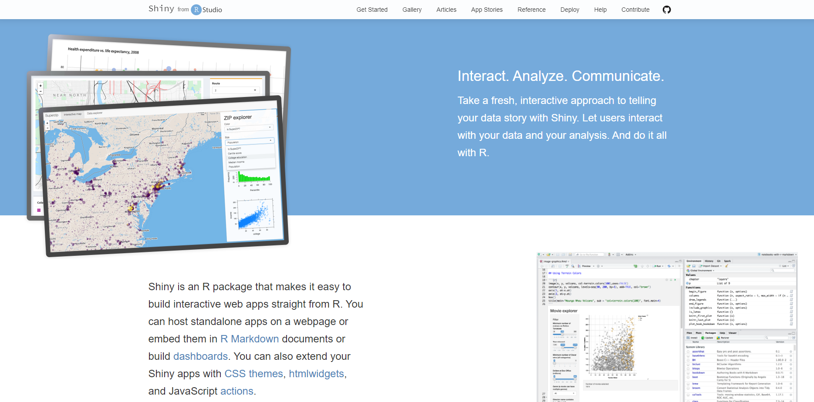
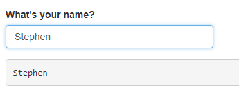
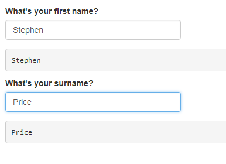

```{r echo=FALSE}
knitr::opts_chunk$set(echo = FALSE, message = FALSE, warning = FALSE)

library(knitr)
```

# Intro

- What are shiny modules? Why are modules useful?
- How do modules work?
- How do you get modules to communicate?

---

# Revision: What is R shiny?



---

# Revision: What is R shiny?

- paired ui and server functions

.pull-left[
```{r echo=TRUE, eval=FALSE}
ui <- shiny::fluidPage(
  shiny::br(),
  shiny::textInput("text", "What's your name?"),
  shiny::verbatimTextOutput("out")
)

server <- function(input, output, session){
  output$out <- shiny::renderText(
    input$text
  )
}

shiny::shinyApp(ui, server)

```
]

.pull-right[

]

---

# Revision: What is R shiny?

- paired ui and server functions

  - our ui function prescribes how an app will look
  - our server function makes provision for all the computations required to deliver the desired functionality
  - paired in that you need to run them together to build an app. The UI looks to the server to populate its defined elements.
  
**Modules are sort of an app in miniature in that they are also paired ui and server functions which take care of namespaces**

--

## Tangent: functions

- Thinking about the code you write, what are functions for you? why do you use them?

---

# Why function?

--

Functions:

1. Limit duplication of code (fewer errors)
2. Improve bug detection, code review and other aspects of production
3. Make code more readable

--

**Of course, the same is true for using functions within your shiny app code**

---

# Functions with shiny

Let's use a function to extend our basic app



---

# Functions with shiny

```{r echo=TRUE, eval=FALSE}
ui <- shiny::fluidPage(
  shiny::br(),
  shiny::textInput("first", "What's your first name?"),
  shiny::verbatimTextOutput("pre"),
  shiny::textInput("last", "What's your surname?"),
  shiny::verbatimTextOutput("sur")
)

server <- function(input, output, session){
  output$pre <- shiny::renderText( input$first )
  output$sur <- shiny::renderText( input$last )
}

shiny::shinyApp(ui, server)

```

---

# Functions with shiny

```{r echo=TRUE, eval=FALSE}
show_name <- function(IDin, label, IDout) {
  shiny::tagList(
    shiny::textInput(IDin, paste0("What's your ", label, "?")),
    shiny::verbatimTextOutput(IDout)
  )
}
```

---

# Functions with shiny

.pull-left[
```{r echo=TRUE, eval=FALSE}
ui <- shiny::fluidPage(
  shiny::br(),
  show_name("first", "first name", "pre"),
  show_name("last", "surname", "sur")
)

server <- function(input, output, session){
  output$pre <- shiny::renderText( input$first )
  output$sur <- shiny::renderText( input$last )
}

shiny::shinyApp(ui, server)

```
]

.pull-right[

]

---

# Using a module instead

Now, I said that modules are paired ui and server functions that take care of namespacing and we've already written a function that's effectively a UI function so let's start with that.

---

# Module UI

```{r echo=TRUE, eval=FALSE}
show_name <- function(IDin, label, IDout) {
  shiny::tagList(
    shiny::textInput(IDin, paste0("What's your ", label, "?")),
    shiny::verbatimTextOutput(IDout)
  )
}
```

--

```{r echo=TRUE, eval=FALSE}
showNameUI <- function(id, label) {
  ns <- shiny::NS(id)
  shiny::tagList(
    shiny::textInput(ns("input"), paste0("What's your ", label, "?")),
    shiny::verbatimTextOutput(ns("out"))
  )
}

```

---

# Module Server

--

```{r echo=TRUE, eval=FALSE}
server <- function(input, output, session){
  output$pre <- shiny::renderText( input$first )
  output$sur <- shiny::renderText( input$last )
}

```

--

```{r echo=TRUE, eval=FALSE}
showNameServer <- function(id) {
  moduleServer(id, function(input, output, session) {
    
    output$out <- shiny::renderText( input$input )
  
  })
}

```

---

# App with module

.pull-left[
```{r echo=TRUE, eval=FALSE}
ui <- shiny::fluidPage(
  shiny::br(),
  showNameUI("first", "first name"),
  showNameUI("last", "surname")
)

server <- function(input, output, session){
  showNameServer("first")
  showNameServer("last")
}

shiny::shinyApp(ui, server)

```
]

--

.pull-right[
```{r echo=TRUE, eval=FALSE}
ui <- shiny::fluidPage(
  shiny::br(),
  shiny::textInput("first", "What's your first name?"),
  shiny::verbatimTextOutput("pre"),
  shiny::textInput("last", "What's your surname?"),
  shiny::verbatimTextOutput("sur")
)

server <- function(input, output, session){
  output$pre <- shiny::renderText( input$first )
  output$sur <- shiny::renderText( input$last )
}

shiny::shinyApp(ui, server)

```
]

---

# Namespace

A namespace is a space for names - an environment to go and look in for a name.

```{r echo=TRUE, eval=FALSE}
shiny::br()
htmltools::br()
shiny::renderText( input$first )
```

--

In terms of another structure that you might be more familiar with, it doesn't hurt to think of a namespace as being like a list.

```{r echo=TRUE}
a <- list()
a$a <- 1:5
a[["b"]] <- 6:10

a[["a"]]
a$b
```

---

# Namespace 2

```{r echo=TRUE}
a <- list()
a$a <- 1:5
a[["b"]] <- 6:10

x <- list()
x$a <- c("a", "b", "c")
x[["b"]] <- c("d", "e", "f")
```

---

# Why are modules useful?

--

1. Limit duplication of code (fewer errors)
2. Improve bug detection, code review and other aspects of production
3. Make code more readable

---

# How do modules work?

By using a shared and dedicated namespace to allow paired UI and server functions to work with a set of names meaning that we avoid collisions.

---

# Module communication

```{r echo=TRUE, eval=FALSE}
goButton <- function(id) {
  ns <- NS(id)
  
  column(width = 12,
         actionButton(
           ns("draw"), 
           "Apply selections", 
           style = "color: #fff; background-color: #337ab7; border-color: #2e6da4",
           width = "100%"
           )
         )
}

goServer <- function(id) {
  moduleServer(id, function(input, output, session) {
    reactive(input$draw)
  })
}
```

```{r echo=TRUE, eval=FALSE}
# collects info about user clicks on draw ("Apply selections") button
left_go <- goServer("left_draw")

# filters data based on user inputs on click
data <- filterServer("left_menu", dq, left_go)

```

---

# Thanks

Some useful resources:

- [Chapter 19 of Mastering Shiny](https://mastering-shiny.org/scaling-modules.html)
- [Fantastic blog/demo](https://thatdatatho.com/communicating-shiny-modules-simple-example/)
